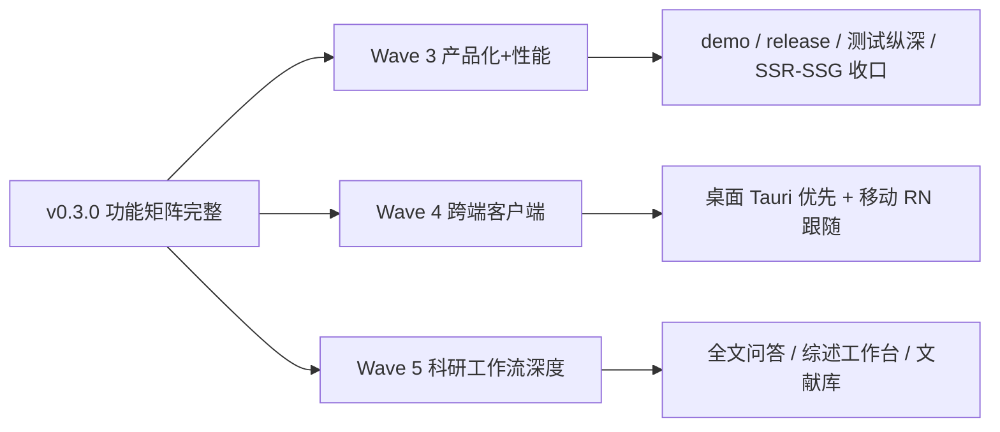

# Papex 下一步发展方向研究（刷新版 2026-09-25）

> 研究视角：项目技术合伙人（MaiBot）
> 目的：在 2026-08-17 / 2026-09-03 路线图基础上，**基于 2026-09-25 真实代码状态**（v0.3.0 已发布）校准第三波方向。旧版「收口半成品 + AI 层 + 跨端地基」已落地，现重点转移到「产品化分发 + 跨端客户端 + 科研工作流深度」。
> 配套规划文档：`多端扩展方案-桌面与移动.md`（跨平台）、`SSR-SSG-结合优化方案.md`（渲染优化）。

---

## 执行摘要

1. **Papex 功能矩阵已极度完整**，且 2026-08-17 路线图里最大的两个空白（P0-A 语义检索、P0-B 外部导入）**均已落地**。平台已接近商用级。
2. **当前最大问题是「半成品与未提交改动」**（2026-09-03 工作树实测）：
   - `push_devices` 表已加入 schema + register/unregister 路由，但**没有迁移文件**（仅到 `0012_qr_sessions.sql`）→ `db:migrate` 不会建表，推送功能无法运行。
   - `recommendations` 路由只是「按兴趣分类取高被引论文」的**启发式**，没用上已就绪的 embedding 语义层，且无前端页。
   - `notes` / `reading_progress` 后端接口已就绪，但**前端未接入**。
   - 跨端客户端（papex-app / papex-desktop）**尚未启动**，仅铺了 API 地基（QR 登录、跨端 sync、devices 表雏形）。
3. **真正的下一步差距**已从「数据/检索」前移到「AI 智能层 + 生态连接 + 跨端落地 + 成熟度治理」。
4. **立即可做（半天～1 天）**：补 push_devices 迁移 0013、提交未提交改动、复检 GitHub 依赖告警、补全 seed 分类描述。

> 旧版（2026-08-17）的「行业对标信号」与 P1/P2 描述仍然成立，本文在第三节引用，未重复展开。

---

## 0. 2026-09-15 增补：路线图落地核对

> 本文件第三、四、五节的 P0/P1/P2 与「立即可做」清单，已于 2026-09-15 批量落地。下方为逐项核对结果（代码实态，`git log` 至 09fbd5a 之后的本轮改动）。

### P0 — 已全部落地

- ✅ **P0-C 推送闭环**：`push_devices` 迁移 0013 + register/unregister/vapid 接口；`lib/push/send.ts` Web Push 发送器（VAPID，失效设备自动清理）；触发点挂在 `createMessage`（工单回复/站内信/协审/审核结果）与 `notifyNewPaper`（新论文订阅）；`public/sw.js` + 设置页开关（按 token 注销，保留其他端设备）。
- ✅ **P0-D 语义推荐**：`listPapers` 新增 `similarToPaperId` 模式（pgvector 近邻，无 embedding/无源向量时回退）；`/api/recommendations` 双池混合（语义近邻 + 分类高被引）；论文页「相关论文」在有 embedding 时语义化；feed「为你推荐」区块（i18n zh/en）。
- ✅ **P0-E 笔记/进度前端**：论文页「阅读与批注」页签（进度条 + 高亮/笔记增删改色）；顺带修复 `notes.rect` NOT NULL 与 `reading-progress` GET 版本写死两个隐性 bug。

### P1 — 已落地

- ✅ **P1-C AI 辅助层**：`lib/ai/provider.ts`（OpenAI 兼容 chat/completions，可本地）；`lib/ai/tldr.ts` TLDR 强制引用溯源（`evidence` 必须是摘要原文子串，服务端校验丢弃不合规点）+ 置信度；`lib/ai/review.ts` 站内 RAG 综述（逐条标注来源论文 id）；`ai_summaries` 缓存表（迁移 0014）+ 登录限流；能力门控 `capabilities.aiSummaries`；论文页 AI 摘要卡 + 检索页「生成综述」。
- ✅ **P1-D 代码/数据关联**：`paper_links` 表（迁移 0015）+ `/api/papers/{id}/links`（GitHub 自动识别 owner/repo 标题，仅存元数据不镜像内容）；论文页侧栏卡片（作者/审核者可增删）。
- ✅ **P1-E 开放评审**：`co_reviews.is_public`（迁移 0016）+ PATCH 可见性开关（指派方/管理员）；论文页「公开评审」卡片；版本 diff（`lib/diff.ts` LCS + `/api/papers/{id}/diff` + 版本历史内联对比）；ORCID 导入（`/api/me/orcid/import`，DOI 匹配去重 + 标准导入管线，限流）。

### P2 — 部分落地

- ✅ **P2-A Phase 0（跨端地基）**：PWA manifest + Service Worker 离线壳（网络优先 + 缓存回退）；`/api/papers/{id}/export` 离线数据包；`packages/api-client` 零依赖跨端客户端骨架（refresh/devices/recommendations/notes/progress/export）。QR 登录、跨端 sync、devices 已就绪 → 后端契约齐，下一步是真实 RN/Electron 仓库。
- ✅ **P2-B 安全**：`npm audit fix` 升级 next 16.3.5（修复 critical RCE）、nodemailer 9.1.1；CI 增加官方 registry 高严重度审计门禁。遗留：vitest 4.1.10 三个 moderate（dev-only，vitest 5 有依赖冲突暂不升）。
- ✅ **P2-C 性能**：`scripts/benchmark.ts` HTTP 延迟基准（p50/p90/max、有界并发、零依赖）。
- ✅ **P2-D 测试**：新增 `lib/ai/tldr.test.ts`（溯源门禁）、`lib/paper-links.test.ts`、`lib/diff.test.ts`；e2e 新增 `paper-new-blocks.spec.ts`（阅读页签/代码与数据/版本历史）。
- ✅ **P2-E 文档**：CONTRIBUTING.md；README(zh/en) 功能矩阵补 10 行新能力；docs 首页功能网格补 5 项；release 工作流（tag → build + release notes）；OpenAPI 从 45 路径扩到 67 路径（补全 recommendations/push/notes/reading-progress/qr/refresh/devices/ai/diff/export 等片段）。

### 剩余开放项（下一轮）→ 已在 2026-09-25 部分收口

- **真实跨端客户端**：P2-A 的 RN/Tauri 仓库与上架（仍开放，见第三波）。
- **vitest moderate 升级** → ✅ 已升 `vitest@4.1.11`，开放 Dependabot 告警清零，`npm audit` 0 vulnerabilities。
- **大规模数据基准**：本地小数据基线已跑（见下）；**大体量 / pgvector 调优仍开放**。
- **seed 分类描述**、公开演示实例、规范 release 流程 → release 工作流已产出 **v0.3.0**；公开演示实例见第三波清单。

---

## 0b. 2026-09-25 增补：第三波规划（Wave 3–5）与本轮收口

### 本轮已完成（2026-09-25）

| 项 | 结果 |
| --- | --- |
| 推送积压 | 10 个提交已推送 `origin/main`（含两波 NEXT-DIRECTIONS 功能） |
| 发布 | `v0.3.0` tag + GitHub Release（Release 工作流 success） |
| 安全 | vitest 4.1.10→4.1.11；开放告警 0；历史 critical/high（next RCE、nodemailer、sharp 等）均已随 lockfile 修复 |
| 质量门禁 | `tsc` 干净、`eslint` 0 error、`vitest` 85/85 |
| 性能基线 | 本地 20 论文库 / concurrency=8 / 20 iter：`/api/papers?pageSize=10` p50≈7ms p90≈10ms；`/api/search` p50≈6–7ms；`/api/categories` p50≈5.5ms；`/api/health` p50≈5.7ms。**语义检索与关键词延迟接近，需在开启 embedding 且有向量时复测** |
| 渲染现状 | `next build` 显示 `/` ISR 5m、`/categories` ISR 1h、`/papers/[id]` SSG——SSR-SSG 方案已部分生效，全站仍有大量动态路由 |

### 迁移编号备注

`drizzle/meta/_journal.json` 中 `idx:18` 对应 tag `0019_add_saved_searches`，**历史上跳过了 0018 文件名**。链完整可迁移，**不必重编号**；后续新迁移从 `0020` 起继续即可。

### 第三波方向总览

> 核心判断：**再堆功能的边际收益已经很低**。接下来投「让人用得上（分发/跨端）」和「让人离不开（科研工作流）」。

#### Wave 3 · 产品化与性能（2–4 周）— 优先

| 优先级 | 事项 | 要点 | 工作量 |
| --- | --- | --- | --- |
| P0 | **公开演示实例常态化** | 见下方清单；Vercel/自托管 + Neon + seed；健康检查进 README badge | S |
| P0 | **SSR/SSG 收口** | 按 `SSR-SSG-结合优化方案.md`：根布局 cookie 外移；公开页 SSG/ISR；个性化页保留 SSR；`revalidate` 挂 mutation | M |
| P1 | **测试纵深** | e2e 补 submit / bookmark / co-review / admin / 工单；`lib/services` 覆盖率目标 ≥60% | M |
| P1 | **大规模基准** | 万级论文 + 真实 embedding 后再跑 `scripts/benchmark.ts`；HNSW 参数 / 分页 / 缓存 | S–M |
| P2 | **依赖与工具链** | TS7 / ESLint 新规则解封后迁移；capabilities 的 Turbopack 全项目 trace 警告收口 | S |

#### Wave 4 · 跨端客户端（1–2 月）

依 `多端扩展方案-桌面与移动.md` Phase 1–2：**桌面 Tauri 2 + Vite React 先行**（科研主场景在桌面读 PDF、无商店审核），**RN 移动端跟随**（可先 PWA 验证）。`packages/shared` 承载 OpenAPI 类型 + i18n + api-client。

#### Wave 5 · 科研工作流深度（持续）

1. **全文 PDF 问答**（Chat with Paper）——RAG 从摘要扩到全文分块，沿用强制溯源 + 置信度
2. **文献综述工作台**——Writespace + AI 大纲 + 引用管理器
3. **Zotero 式文献库**——智能收藏夹、更强 PDF 阅读/高亮
4. Papers With Code 加深（benchmark 排行仍是深坑，本期只做最小可用）
5. 课题组协作空间

### 公开演示实例清单（Wave 3-P0）

1. 数据库：Neon / Supabase（pgvector）或自托管 `docker compose up db`
2. 环境：复制 `.env.example`，必填 `DATABASE_URL` / `DATABASE_URL_UNPOOLED` / `AUTH_SECRET`；可选 embedding / AI / 推送
3. 迁移与种子：`npm run db:migrate && npm run db:seed && npm run db:seed-arxiv`
4. 部署：Vercel 导入仓库（`vercel.json` 已有）或 `docker compose up --build`
5. 验收：`/api/health` 全绿（notifications 可 degraded）、首页有论文、检索可用、设置页可登录
6. 运维：只读演示账号 + 定期重置种子；`scripts/benchmark.ts` 周期打点

---

## 一、当前真实状态盘点（2026-09-03）

### 1.1 已落地能力（含 8-17 后新增）

| 能力域 | 落地情况 |
| --- | --- |
| 投稿与版本 | `/submit` + 版本快照、撤稿原因、无 PDF 禁令（迁移 0011） |
| 检索 | 多语言全文（tsvector+pg_trgm）+ **语义/混合检索（pgvector 1024 维 HNSW，P0-A）** + 布尔/字段/时间/被引排序 |
| 外部导入 | Crossref/arXiv/SemanticScholar/OpenCitations 映射抓取 + `paper_external_ids` 去重（P0-B）；arXiv 20 领域抓取脚本 |
| 引用体系 | 引用图谱、共引/同被引/二级引用、GB/T 7714·BibTeX·APA、引用数排序 |
| 文献计量 | H 指数、合作网络、发文趋势、关键词共现、热词云 |
| 社区 | 标签、收藏分组、订阅/通知中心、站内信、工单状态机、反馈、协同评审闭环 |
| 治理 | RBAC（17 权限/7 组/4 角色）、角色后台、背书门禁 |
| 创作 | Writespace（LaTeX 编译 + 导出 + 发布）、`notes` 高亮/批注接口 |
| 工程 | 双存储（local/s3）、能力门控、中英+**9 语言文档站**、**API Keys + 代码优先 OpenAPI(Scalar)**、CI、Docker(pgvector)、QR 登录+跨端 sync |
| 国际化 | 257 分类双语(name_zh)、logo、9 语言 locales |

### 1.2 半成品 / 未提交（关键发现，需收口）

| 项 | 现状 | 缺口 |
| --- | --- | --- |
| 推送 `push_devices` | schema + register/unregister 路由已写 | **缺迁移 0013**；无实际发送器（FCM/APNs/Web Push）；无触发点；无 UI |
| 推荐 `recommendations` | 后端按兴趣分类取高被引 | 未用 embedding 语义层（仍是 P1-C 的简化版）；无前端页 |
| 笔记 `notes` | 完整高亮/批注接口 | 前端未接（论文页无标注 UI） |
| 阅读进度 `reading_progress` | `[paperId]` 接口 | 前端未接 |
| 跨端客户端 | 仅 API 地基（QR 登录、跨端 sync、devices 表雏形） | papex-app / papex-desktop 独立仓库未启动 |

### 1.3 相对 2026 主流仍缺

- **AI 层（P1-C）**：TLDR/分层摘要、站内语料 RAG 综述、语义推荐——embedding 层已就绪但**未接 LLM**。
- **论文-代码-数据集关联（P1-D）**：无 Papers With Code 式 repository/dataset 关联。
- **开放评审增强（P1-E）**：评审可见性开关、版本 diff、ORCID 导入。
- **实际推送发送** + 通知触发（新论文/工单回复/站内信）。
- **安全**：GitHub 是否仍有 high 级依赖告警需复检（旧版记录的 dependabot/21）。
- **成熟度**：大规模数据性能基准、明确测试覆盖率目标、公开演示实例。

---

## 二、行业对标信号（2026，沿用旧版结论）

- 语义/向量检索已成主流（混合检索准确率 +~47%，跨语言问答已落地）。
- 多模态发现：代码仓库、数据集、图表纳入索引。
- AI 综述 + RAG + 溯源（每条结论带置信度+溯源地图，强制可验证）。
- 开放评审透明化（OpenReview 范式）；论文-代码-数据集强关联成工程标配。
- 影响力动量（引用速度）替代滞后累计引用。
- 跨平台互认与去重（S2/arXiv/DOI 映射）。

> 结论：Papex「功能完整度」已接近商用，下一步补「AI 智能 + 生态连接 + 跨端落地」。

---

## 三、下一步方向（按优先级）

### P0 — 收口半成品（S–M，立即可排）

#### P0-C 推送闭环
- **是什么**：补 `push_devices` 迁移 0013 → 可插拔推送发送器（Web Push / FCM / APNs，能力门控）→ 触发点（新论文入库、工单回复、站内信）→ 设置页开关。
- **为什么**：基建已写一半却跑不起来，是明显的技术债与体验缺口。
- **落地要点**：先 Web Push（无需移动证书）打通端到端，再补 FCM/APNs；发送器与触发点解耦，复用现有 `messages` 事件。
- **工作量**：M
- **风险**：APNs/FCM 需证书；Web Push 需 VAPID，自托管可用。

#### P0-D 语义推荐升级
- **是什么**：把 `recommendations` 的「高被引启发式」升级为基于 embedding 的「相似论文 / 协作者 / 共读」推荐，复用 P0-A 向量层。
- **为什么**：embedding 已落地却只服务检索，推荐是性价比最高的二次复用。
- **落地要点**：`listPapers` 加 `similarTo` 模式（pgvector 最近邻）；前端「为你推荐」区块；无 embedding 时回退现有启发式（沿用能力门控）。
- **工作量**：S–M
- **风险**：冷启动（新用户无兴趣）→ 回退热门/最新。

#### P0-E 个人知识管理前端化
- **是什么**：论文页接入 `notes`（高亮/批注）与 `reading_progress`（进度条），形成轻量 PKM。
- **为什么**：后端已就绪，前端未接 = 功能不可见。
- **工作量**：S–M
- **风险**：标注坐标持久化格式（自定 JSON：页/四角/颜色/文本）。

### P1 — AI 增强 + 生态连接

#### P1-C AI 辅助层（可插拔 LLM）— 本期核心增量
- **是什么**：论文 TLDR / 分层摘要、站内语料 RAG 综述生成、语义「相关论文」推荐；LLM 后端可插拔（OpenAI/兼容/本地）。
- **为什么**：2026 用户期待 AI 综述+溯源；必须「可关、可本地」守住开源自托管定位。
- **落地要点**：`lib/ai/` 抽象 + `capabilities` 门控；**每条结论强制带引用溯源(Provenance)+置信度**，杜绝幻觉；RAG over P0-A 站内向量。
- **工作量**：M（依赖 P0-A 已就绪）
- **风险**：幻觉→强制溯源；成本/延迟；本地模型质量。

#### P1-D 论文-代码-数据集关联（Papers With Code 风格）
- **是什么**：`repositories` / `datasets` 表；论文页展示 GitHub/数据集链接 + 轻量 benchmark 占位。
- **落地要点**：先做「链接关联」（作者填 URL+自动识别），**暂不做排行榜**（维护成本极高）。
- **工作量**：S–M

#### P1-E 开放评审透明化增强
- **是什么**：评审意见公开开关、版本修订对比(diff 视图)、ORCID 导入出版物。
- **落地要点**：评审可见性开关；版本 diff；ORCID API 拉取作者已发表作品。
- **工作量**：M
- **风险**：公开评审隐私与争议治理。

### P2 — 跨端 + 成熟度治理

#### P2-A 跨平台客户端（Phase 0 起步）
- 依 `多端扩展方案-桌面与移动.md`：monorepo + `packages/shared`(API client+OpenAPI 类型)、认证改造(refresh token+devices 已雏形)、后端补齐笔记/进度/离线包接口、PWA 壳先验证移动端 API 契约。
- 工作量：Phase 0 约 4–6 人周；移动 MVP 6–8；桌面 MVP 8–10。
- 风险：鸿蒙 RNOH 适配、上架合规（证书/公证）、Next.js 组件复用边界（RSC 不能直接迁）。

#### P2-B 安全与依赖治理
- 复检 GitHub high 告警；CI 加依赖审计；持续跟踪 TS7/ESLint10 解封。

#### P2-C 性能与可扩展性验证
- 大规模数据下检索/分页/缓存基准；pgvector 索引调优；CDN/缓存策略。

#### P2-D 质量与测试加固
- 为 tag/bookmark-group/citation-analytics/bibliometrics/co-review 补 e2e；明确覆盖率目标。

#### P2-E 文档与分发
- seed 分类「Description coming soon」补全；`about` 与 README 功能清单对齐；新增 CONTRIBUTING；部署公开演示实例；badges；规范 release 流程。

---

## 四、推荐分阶段路线图

- **阶段 1 · 收尾闭环（1–2 周）**：P0-C（推送迁移+发送） → P0-D（语义推荐） → P0-E（笔记/进度前端）。把已写一半的功能全部跑通可见。
- **阶段 2 · 智能化（1–2 月）**：P1-C（AI 层）→ P1-D（代码/数据关联）→ P1-E（开放评审增强）。
- **阶段 3 · 跨端与成熟（持续）**：P2-A 跨端 Phase 0→MVP → P2-B/C/D/E 治理。

> 顺序判断：P0 收尾应**先于** P1，因为半成品是确定性债务且部分基建（embedding/recommendations/notes）直接被 P1 复用；P1-C 强依赖 P0-A 向量层（已就绪），故紧随其后。

---

## 五、立即可做（半天～1 天）

1. **补 `push_devices` 迁移 0013**（`npm run db:generate`）——否则推送功能无法运行，是当前最明确的阻断项。
2. **提交未提交改动**：`push`/`recommendations`/`notes` schema 改动 + `多端扩展方案-桌面与移动.md` 等规划文档先入库，避免工作树膨胀丢失。
3. **复检 GitHub 依赖告警**（旧版 dependabot/21 是否仍 high）。
4. **补全 `seed.ts`「Description coming soon」**分类描述。

---

## 六、风险与开放问题

- **定位取舍**：通用学术基础设施 vs 某细分领域（CS 偏 arXiv，Crossref 全覆盖）——决定外部导入优先接哪些源。
- **自托管约束**：语义检索/AI/推送必须可关、可本地，否则违背开源自托管卖点。
- **版权红线**：PDF 与全文抓取受版权限制，导入层只动元数据+链接，PDF 走授权路径。
- **范围控制**：P1-D 的 benchmark 排行榜、P1-C 的「可执行综述」是深坑，本期只做最小可用。
- **跨端仓库策略**：papex-app/papex-desktop 是独立仓库还是 monorepo 子包？Phase 0 决定，建议 `packages/shared` 抽公共层、客户端独立仓库复用。
- **半成品治理**：建立「功能写一半即视为未完成」的约定，避免 schema/路由先于迁移与 UI 落地造成隐形债。
